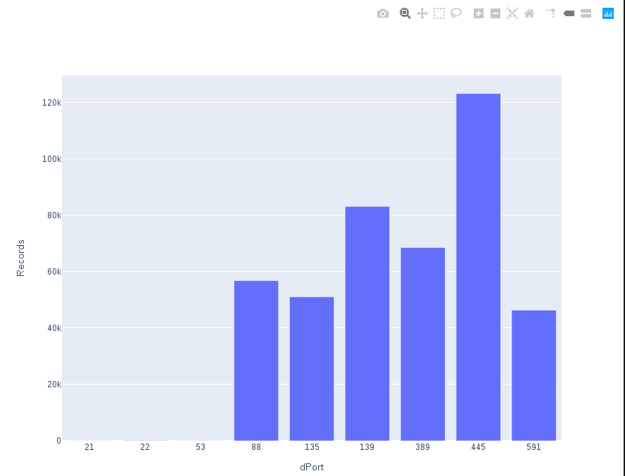
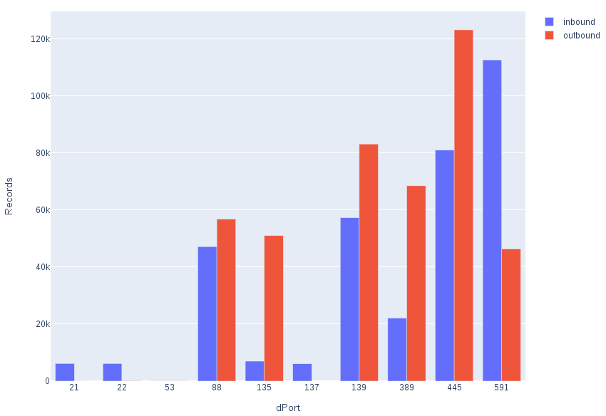

# Investigating Suspicious TCP Behavior

I started this investigation by following installing the silk fedora vm from https://tools.netsa.cert.org/livedvd.html#. I then downloaded the data set from https://tools.netsa.cert.org/silk/referencedata.html and followed the instructions for unpacking and using rwfilter. Lastly I downloaded the silk data analysis book from https://tools.netsa.cert.org/silk/analysis-handbook.pdf and began on chapter 7.  

In order to execute the graphing scripts python 2 must be installed along with pandas and plotly. These can be installed using ```pip2 install pandas``` and ```pip2 install plotly``` respectively.  

## Level 0: Which TCP Requests are Suspicious. 

The purpose of this case study is to identify incoming and outgoing tcp requests and attempt to find  a pattern that will help guide towards recognizing what is suspicious behavior. Follwing the steps below using the commands provided in the book we can take a look at the incoming and outgoing tcp requests, the ports they are on, and the number of requests. I have added a folder to this repo with the commands I used to accomplish and visualize the data. 
### Steps: 
   1. Use rwfilter to read all incoming TCP traffic for sensors S0 through S4   
  ```bash
   ./inbound_tcp_count_sort > inbound.csv && ./tcp_port_graph.py inbound.csv
   ```
   This gives us a graph showing the port with the number of records:
   

   2. Use rwfilter to read all outgoing TCP traffic for sensors S0 through S4
   ```bash
   ./outbound_tcp_count_sort > outbound.csv && ./tcp_port_graph.py outbound.csv
   ```
   This gives us a graph showing the outbound tcp requests by port and number of records. 
   

   3. Now we can compare the two using our third graph:
   ```bash
   ./outbound_vs_inbound_graph.py
   ```

   This gives us our inbound and outbound side by side:
   

## Level 1: How Can We Identify and React to Illegitimate Requests?

We start by attempting to recognize strange requests or those with no request or no response. 
By looking at the inbound versus outbound graph, we can see that ports 21, 21, 591 have suspicious traffic as their inbound data is far greater than the outbound data. 

### Steps: 
   1. Filter the inbound traffic for ports 21, 22, and 591: 
   ```bash
   ./filter_suspicious_inbound
   ```
   2. Filter the outbound traffic for parts 21, 22, and 591: 
   ```bash
   ./filter_suspicious_outbound
   ```
   3. Match the inbound and outbound in order to find the mismatched(suspicious) traffic:
   ```bash
   ./match_inbound_and_outbound
   ```
   4. Filter unmatched records with a next hop IP that indicate either a no response or a no request: 
   ```bash
   ./filter_unmatched_to_no_response_no_request
   ```
   5. Display information about the top five IP's and ports with no response flows:
   ```bash
   ./display_no_response | ./convert_to_csv > no_response.csv && ./graph_unmatched.py no_response.csv
   ```
   

   6. Display information about the top five IP's and ports with non matching query and response flows:
   ```bash
   ./display_no_request | ./convert_to_csv > no_request.csv && ./graph_unmatched.py no_request.csv
   ```
   

## Level 2: What are the Illegitimate Sources and Destinations Doing?  
### Level 2A: What are the Illegitimate Source IPs Doing?  
### Steps:  
   1. Reusing temp-noresp.raw from the previous section we create a set of source IPs that do not have matching queries. (this is not how it is done in book. the rwbag tool was not functioning properly and had to be changed to run in a legacy form.)
   ```bash
   ./create_unmatched_source_ips
   ```
   2. Filter and pull the records from the source IPs from previously created set.:
   ```bash
   ./pull_unmatched_records_from_source_IPs
   ```
   3. Find and format all records from the source IPs that contain only a header and some extraneous data:
   ```bash
   ./filter_low_data_source_records
   ```
   4. With the previous command we are now given two txt files with the contents: 
      1. We are given the protocol number, number of bytes, number of records, and the start and end times.
     
   and  
      2. The fields file shows us the ip address and the start and end time.   
     
   Based on these results we can say that the traffic is consistent with scanning, as they are all within a short amount of time and are sending only headers to our TCP and UDP ports.   
## Level 2B: What Behavior Changes do Destination IPs Show?  
### Steps:
   1. Store our source-fields.txt into a shell array:
   ```bash
   srcArray=( $(cat source-fields.txt ) )
   ```
   2. Convert earliest start time into UNIX epoch integer: 
   ```bash
   StEpoch=$( date -d ${srcArray[1]} +"%s")
   ```
   3. Subtract one from epoch value so time is right before the earliest start time.
   ```bash
   StTime=$( echo $(( $StEpoch-1 )) | awk '{ print strftime ("%Y/%m/%dT%T",$1 )} ')
   ```
   4. Repeat two but for the end time:
   ```bash
   EnEpoch=$( date -d ${srcArray[2]} +"%s")
   ```
   5. Repeat 3 for end epoch adding one to the time instead of subtracting.
   ```bash
   EnTime=$( echo $(( $EnEpoch-1 )) | awk '{ print strftime ("%Y/%m/%dT%T",$1 )} ')
   ```
   6. We will now pull non-web inbound and outbound traffic for the destination IPs in noresp.set before the scan:
   ```bash
   ./filter_non_web_inbound_outbound_before
   ```
   7. Next we filter out the illegitimate IPs for inbound and outbound traffic after the scan:
   ```bash
   ./filter_non_web_inbound_outbound_after
   ```
   8. We now pull off the headers and store them in a file called myhead:
   ```bash
   rwuniq --fields=bytes,protocol --values=Flows,distinct:sip,distinct:dip dest-before.raw | head -1 > myhead
   ```
   9. Then we calculate the flows for before the scan:
   ```bash
   ./create_flows_before_graph
   ```
   
   10. Then we calculate the flows for after the scan:
   ```bash
   ./create_flows_after_graph
   ```
   

## Level 3: What are the Commonalities Across The Cases?
### Summary:
By taking a look at the traffic during this time frame, we can see that there is some suspicious traffic. By narrowing down our results, starting with the incoming and outgoing traffic we can begin to spot some concerning behavior. When small requests are made that do not trigger valid responses as shown in the second graph of Level 1 we see that some of our ports are receiving many requests and getting a small number of responses. From there we narrowed down the data by filtering for all requests that had no matching response call and seeing how often and by whom these requests were being made. We were able to see from the data in Level_2A and the graphs in Level2B that an external source is scanning our ports. Due to the high number of small requests and low number of responses on ports where services are not available we can conclude that this external IP is port scanning using a tool like nmap. We could recreate this case study on our own machine by using a virtual machine or another host to run nmap scans while wireshark is running on our NetSA machine. This will give us very similar results. With some small tweaks to the scripts provided in this repo we can recreate the graphs using our wireshark pcap. 
